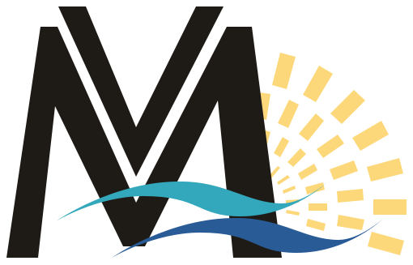

# 
 Le Vieux Moulin
Site web créé bénévolement dans le câdre des cours de Design Web à la HEPL 

## Qui sont-ils ?
Le Vieux Moulin est une SRG ayant pour but de s’occuper d'enfants retirés de leurs parents pour des raisons juridiques.

## Design
Voici le design que j’ai imaginé pour le site web du Vieux Moulin. Toutes les informations se trouvent <a href="https://www.figma.com/design/5Drr1jqpHC4mKd268Kirau/Client-25?node-id=187-540&t=LbDXCdBfTSu5reWK-1">dans le fichier Figma</a>.

## Analyse benchmark
Les différentes analyses y sont listées un peu plus en détail sur la page "Benchmark" du fichier Figma dont le lien est listé plus haut.

